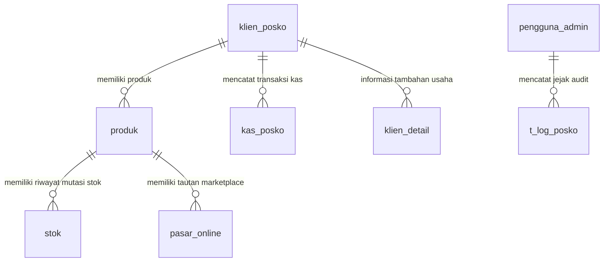

# 🌊 Posko UKM Jasuda — Ultimate Developer Guide & Architecture Documentation

Dokumentasi teknis resmi, panduan arsitektur sistem, struktur basis data, konvensi kode, dan petunjuk operasional lengkap untuk platform **Posko UKM Jasuda Multi-Vendor E-Commerce Platform**.

> 📌 **Panduan Instalasi, Migrasi, & Deployment Server Jasuda**:
> Untuk petunjuk langkah-demi-langkah instalasi lokal, migrasi database ke **phpMyAdmin cPanel**, konfigurasi domain, SSL, dan deployment ke **Hosting / VPS Jasuda**, silakan buka:
> 
> 👉 **[Buka Panduan Instalasi & Deployment Server (INSTALLATION.md)](./INSTALLATION.md)**

---

## 📑 Daftar Isi
1. [Project Overview & Arsitektur Bisnis](#1-project-overview--arsitektur-bisnis)
2. [Tech Stack & Rationale Pustaka](#2-tech-stack--rationale-pustaka)
3. [Arsitektur Database & Relasi Tabel MySQL](#3-arsitektur-database--relasi-tabel-mysql)
4. [Autentikasi, Middleware, & Role-Based Access Control (RBAC)](#4-autentikasi-middleware--role-based-access-control-rbac)
5. [Struktur Direktori Proyek Mendalam](#5-struktur-direktori-proyek-mendalam)
6. [Data Flow & Siklus Mutasi Data](#6-data-flow--siklus-mutasi-data)
7. [Panduan Praktis Pengembangan (Developer Recipes)](#7-panduan-praktis-pengembangan-developer-recipes)
8. [Audit Trail & Activity Logging Protocol](#8-audit-trail--activity-logging-protocol)
9. [Design System & Styling Guide (Ocean Theme)](#9-design-system--styling-guide-ocean-theme)
10. [Konvensi Kode & Standar Kualitas](#10-konvensi-kode--standar-kualitas)
11. [Available Scripts](#11-available-scripts)
12. [Troubleshooting Teknis Developer](#12-troubleshooting-teknis-developer)

---

## 1. Project Overview & Arsitektur Bisnis

### 1.1 Latar Belakang & Visi Platform
**Posko UKM Jasuda** adalah platform perdagangan elektronik (*multi-vendor marketplace*) dan katalog komoditas maritim berbasis digital yang mengintegrasikan ekosistem Usaha Kecil dan Menengah (UKM) binaan jaringan Jasuda (Jaringan Rumput Laut Binaan). 

Secara arsitektural, platform ini memisahkan dua entitas bisnis utama:
1. **Flagship Store ("Jasuda Internal")**: Gerai resmi yang menampilkan komoditas rumput laut dan produk olahan unggulan berstandar ekspor/premium, dilengkapi tautan langsung ke pasar daring (*Shopee Official Store*), serta pengalaman visual 3D interaktif.
2. **Tenant Stores ("Mitra Posko UKM")**: Puluhan gerai independen mitra posko binaan di seluruh daerah di Indonesia dengan katalog produk terstandardisasi, pelacakan inventaris lokal, data legalitas izin (PIRT/Halal), dan identitas pengusaha lokal.

### 1.2 Modul & Fitur Utama

```
┌─────────────────────────────────────────────────────────────────────────────┐
│                             POSKO UKM JASUDA                                │
├──────────────────────────────────────┬──────────────────────────────────────┤
│          PORTAL PUBLIK / USER        │         PANEL ADMIN & PENGELOLA      │
├──────────────────────────────────────┼──────────────────────────────────────┤
│ • Dynamic Hero & Multi-Nav Switcher  │ • Dashboard Analitik Penjualan & Kas │
│ • Flagship Jasuda 3D Bento Grid      │ • CRUD Katalog Produk & Stok Terpadu │
│ • 5 Model Navigasi Tenant Interaktif │ • Modal Selector Toko & Live Search  │
│ • Modal Detail Produk & Kalkulator   │ • Manajemen Profil & Legalitas Mitra │
│ • Integrasi Shopee Marketplace Link  │ • Laporan Keuangan & Arus Kas Masuk  │
│ • Otentikasi Pengguna & Registrasi   │ • Audit Trail Log & Ekspor Excel     │
│ • Cek Tarif Ongkir Realtime          │ • Proteksi Role (Admin/Editor/dsb)   │
└──────────────────────────────────────┴──────────────────────────────────────┘
```

---

## 2. Tech Stack & Rationale Pustaka

Platform ini dibangun menggunakan teknologi modern yang memprioritaskan performa rendering, SEO, keandalan transaksi, dan pengalaman pengguna (*user experience*) tingkat tinggi:

| Pustaka / Paket | Versi | Peran Utama dalam Aplikasi |
| :--- | :--- | :--- |
| **Next.js (App Router)** | `16.2.10` | Framework inti. Menggunakan React Server Components (RSC) untuk loading cepat dan Server Actions untuk mutasi database tanpa boilerplate endpoint API REST terpisah. |
| **React** | `19.2.4` | UI Engine generasi terbaru dengan optimalisasi rendering concurrent dan Hooks modern. |
| **TypeScript** | `5.x` | Menjamin type safety, memvalidasi payload server actions, dan mengeliminasi bug runtime saat mapping relasi SQL. |
| **Tailwind CSS** | `4.x` | Styling engine utilitas modern dengan kompilasi instan dan token desain kustom *Ocean Theme*. |
| **mysql2/promise** | `3.11.0` | Driver database MySQL dengan dukungan *Connection Pooling*, *Prepared Statements* (anti-SQL Injection), dan asynchronous Promise handling. |
| **Framer Motion** | `12.42.2` | Animasi interaktif kartu produk, modal popup, 3D tilt tracking kursor mouse, dan transisi layout halaman. |
| **GSAP & Lenis** | `3.15.0` / `1.3.25` | Smooth scrolling engine dan animasi linier performa tinggi pada landing page. |
| **Lucide React** | `1.24.0` | Paket ikon SVG modern, konsisten, dan ringan. |
| **Midtrans Client** | `1.4.3` | SDK resmi payment gateway untuk pemrosesan pembayaran otomatis (QRIS, VA Bank, E-Wallet). |
| **SheetJS (`xlsx`)** | `0.18.5` | Engine pembangkit file spreadsheet Excel (.xlsx) untuk fitur ekspor log aktivitas dan data katalog produk. |
| **clsx & tailwind-merge** | `2.1.1` / `3.6.0` | Penggabung kelas kondisional CSS melalui fungsi helper `cn()`. |

---

## 3. Arsitektur Database & Relasi Tabel MySQL

Platform menggunakan database relasional MySQL. Hubungan antar tabel dan aturan bisnis utamanya dijelaskan di bawah ini:

### 3.1 Ringkasan Skema Tabel Utama



### 3.2 Spesifikasi & Kolom Tabel Kunci

#### 1. Tabel `produk` (Katalog Produk)
Menyimpan seluruh data produk, baik milik Jasuda Internal maupun Mitra Tenant.
* `id_produk` (`int`, PK, Auto-Increment): ID unik produk.
* `id_posko` (`int`, FK ke `klien_posko.id_posko`): ID toko pemilik produk (`78` dan `24` adalah ID Jasuda Internal; ID lainnya adalah Mitra Tenant).
* `kode` (`varchar`): Kode SKU produk / nomor register.
* `nama_produk` (`varchar`): Nama produk.
* `deskripsi` (`text`): Keterangan deskripsi produk.
* `berat_bersih` (`int`): Berat bersih dalam gram (penting untuk perhitungan ongkos kirim).
* `legalitas` (`varchar`): Nomor PIRT / legalitas edar.
* `sertifikat_halal` (`varchar`): Nomor sertifikat halal dari BPJPH/MUI.
* `harga_beli` (`decimal`): Harga modal / HPP produk.
* `harga_jual` (`decimal`): Harga jual konsumen.
* `photo` (`varchar`): Nama file gambar di direktori `/public/image/`.
* `publish` (`enum('Y','N')`): **Catatan Krusial**: Kolom ini bernilai `'Y'` jika produk aktif/ditampilkan dan diprioritaskan sebagai produk favorit.
* `shopee_link` (`varchar`): Tautan langsung ke toko/produk di Shopee (opsional).
* `tgl_inp` (`datetime`): Timestamp produk ditambahkan.
* `log` (`varchar`): Nama pengguna yang terakhir memperbarui entri.

#### 2. Tabel `stok` (Buku Besar Inventaris)
Sistem **TIDAK** menyimpan stok statis pada tabel `produk`. Stok dihitung secara dinamis menggunakan rumus:
$$\text{Stok Tersedia} = \sum(\text{volume\_beli}) - \sum(\text{volume\_jual})$$
* `id_stok` (`int`, PK): ID pencatatan stok.
* `id_produk` (`int`, FK): ID produk terkait.
* `volume_beli` (`int`): Jumlah unit stok masuk (pembelian/produksi).
* `volume_jual` (`int`): Jumlah unit stok keluar (penjualan).
* `harga_beli` / `harga_jual` (`decimal`): Harga pada saat transaksi stok terjadi.

#### 3. Tabel `klien_posko` & `klien_detail` (Data Mitra & Profil UKM)
* `id_posko` (`int`, PK): ID unik mitra/toko.
* `nama_usaha` (`varchar`): Nama toko / brand dagang mitra.
* `nama_penerima` (`varchar`): Nama pemilik / penanggung jawab usaha.
* `alamat`, `kabupaten`, `provinsi`: Alamat domisili mitra posko.
* `telp`, `email`: Kontak komunikasi mitra.
* `rekening_bank`, `no_rekening`: Data perbankan untuk transfer hasil penjualan.

#### 4. Tabel `t_log_posko` (Audit Trail & Activity Log)
Mencatat seluruh riwayat operasional pengelola.
* `id` (`int`, PK): ID log.
* `tgl` (`datetime`): Waktu kejadian aktivitas.
* `aktor` (`varchar`): Nama pengelola yang melakukan aksi.
* `modul` (`varchar`): Kategori modul (`Produk`, `Mitra`, `Keuangan`, `Akun`, `Pesanan`, `Sistem`).
* `aktivitas` (`text`): Deskripsi detail perubahan data (contoh: "Menambahkan produk baru: Rumput Laut Kering").

---

## 4. Autentikasi, Middleware, & Role-Based Access Control (RBAC)

### 4.1 Mekanisme Sesi & Cookie
Autentikasi dikelola secara mandiri tanpa dependensi pihak ketiga berat. Saat login berhasil via `src/lib/actions/auth.ts`:
1. Sistem membuat objek sesi terenkripsi/JSON: `{ uid, email, displayName, role }`.
2. Objek disimpan pada HTTP Cookie bernama `jasuda_session` dengan opsi `HttpOnly`, `SameSite=Lax`, dan masa berlaku 7 hari.

### 4.2 Matriks Hak Akses (RBAC Matrix)

| Modul / Rute URL | Admin | Operator / Pengurus | Editor | User Publik |
| :--- | :---: | :---: | :---: | :---: |
| **Beranda & Katalog Publik (`/`, `/jasuda`, `/mitra/*`)** | ✅ | ✅ | ✅ | ✅ |
| **Katalog Produk Admin (`/admin/produk`)** | ✅ | ✅ | ✅ | ❌ |
| **Dashboard Metrik (`/admin/dashboard`)** | ✅ | ✅ | ❌ *(Redirect ke `/admin/produk`)* | ❌ |
| **Laporan Keuangan (`/admin/keuangan`)** | ✅ | ✅ | ❌ *(Akses Ditolak)* | ❌ |
| **Log Aktivitas Riwayat (`/admin/riwayat`)** | ✅ | ✅ | ❌ *(Akses Ditolak)* | ❌ |
| **Pengaturan Sistem (`/admin/pengaturan`)** | ✅ | ❌ | ❌ *(Akses Ditolak)* | ❌ |
| **Manajemen Staff & Akun (`/admin/akun`)** | ✅ | ❌ | ❌ *(Akses Ditolak)* | ❌ |

### 4.3 Logika Proteksi Middleware (`src/middleware.ts`)
Middleware bekerja pada layer Edge Next.js untuk mencegah request tidak sah sebelum memuat komponen halaman:
* Memeriksa keberadaan cookie `jasuda_session` pada setiap rute yang diawali `/admin/*`.
* Jika pengguna belum login $\rightarrow$ dialihkan otomatis ke `/login`.
* Jika pengguna memiliki peran `editor` dan mencoba mengakses rute terlarang (`/admin/dashboard`, `/admin/keuangan`, `/admin/riwayat`, `/admin/pengaturan`) $\rightarrow$ dialihkan otomatis ke `/admin/produk`.

---

## 5. Struktur Direktori Proyek Mendalam

```
Posko UKM Jasuda/
├── public/                             # File aset statis publik
│   ├── image/                          # Direktori penyimpanan foto produk & logo mitra
│   └── favicon.ico                     # Icon tab browser
│
├── src/
│   ├── app/                            # Next.js App Router (Rute & Layouts)
│   │   ├── (public)/                   # Route Group publik (Katalog, Toko, Auth)
│   │   │   ├── jasuda/                 # Flagship Jasuda Store (3D Hero, Bento Grid)
│   │   │   ├── kontak/                 # Halaman kontak & peta posko
│   │   │   ├── login/                  # Halaman masuk sistem
│   │   │   ├── mitra/                  # Dynamic Route detail toko tenant (`[slug]`)
│   │   │   ├── produk-unggulan/        # Galeri kurasi produk favorit
│   │   │   ├── register/ & signup/     # Pendaftaran akun pembeli
│   │   │   ├── semua-mitra/            # Direktori direktori toko mitra
│   │   │   ├── semua-produk-jasuda/    # Katalog lengkap komoditas Jasuda
│   │   │   └── tentang-kami/           # Profil sejarah & visi Posko UKM Jasuda
│   │   │
│   │   ├── _components/                # Komponen privat landing page
│   │   │   └── HomeClient.tsx          # Beranda utama dengan switcher multi-navigasi
│   │   │
│   │   ├── admin/                      # Panel Dashboard Pengelola
│   │   │   ├── akun/                   # Manajemen staff & peran pengguna
│   │   │   ├── keuangan/               # Laporan kas & analitik pemasukan
│   │   │   ├── mitra/                  # CRUD master data toko mitra
│   │   │   ├── pengaturan/             # Parameter kontak posko & konfigurasi web
│   │   │   ├── pesanan/                # Monitoring transaksi pesanan
│   │   │   ├── produk/                 # Manajemen katalog & inventaris
│   │   │   │   └── _components/        # AddForm, EditForm, StoreSelectorModal, ProdukMitra
│   │   │   ├── riwayat/                # Audit trail log aktivitas & export Excel
│   │   │   └── layout.tsx              # Admin Layout (Sidebar, Header, AdminRouteGuard)
│   │   │
│   │   ├── api/                        # API Route Handlers
│   │   │   ├── ongkir/                 # Endpoint kalkulasi tarif RajaOngkir
│   │   │   ├── upload/                 # Endpoint upload file foto produk ke disk
│   │   │   └── wilayah/                # Endpoint data dropdown kota/kabupaten
│   │   │
│   │   ├── globals.css                 # Master styling Tailwind v4 & token Ocean Theme
│   │   ├── layout.tsx                  # Root HTML Layout dengan StoreProvider
│   │   └── not-found.tsx               # Halaman 404 kustom
│   │
│   ├── components/                     # Reusable UI Components
│   │   ├── admin/                      # AdminSidebar, AdminHeader, StatsCard
│   │   ├── auth/                       # AdminRouteGuard.tsx
│   │   ├── context/                    # StoreContext.tsx (Global State Manager)
│   │   ├── shared/                     # GlobalHeader, GlobalFooter, ProductDetailModal,
│   │   │                               # NavMegaMenu, NavBrandCarousel, NavMasonryGrid,
│   │   │                               # NavAlphabetIndex, NavInteractiveMap
│   │   └── ui/                         # Atomic components (InteractiveProductCard, Button)
│   │
│   ├── lib/                            # Business Logic & Database Layer
│   │   ├── actions/                    # Server Actions (Mutasi langsung ke MySQL)
│   │   │   ├── activity-log.ts         # Audit trail logger (`logActivity()`)
│   │   │   ├── auth.ts                 # Handler login, logout, sesi cookie
│   │   │   ├── dashboard.ts            # Agregasi data statistik & grafik
│   │   │   ├── keuangan.ts             # Transaksi kas masuk/keluar
│   │   │   ├── mitra.ts                # Master data mitra & dropdown query
│   │   │   ├── product.ts              # Master CRUD produk & sinkronisasi stok
│   │   │   ├── staff.ts                # Manajemen akun staf pengelola
│   │   │   └── user.ts                 # Manajemen data akun pengguna
│   │   ├── db.ts                       # MySQL Connection Pool Singleton
│   │   ├── date.ts                     # Formatter tanggal standar Indonesia
│   │   ├── export.ts                   # Export generator file Excel .xlsx
│   │   ├── shipping.ts                 # Integrasi logistik RajaOngkir/Komerce
│   │   ├── upload.ts                   # Utility penulisan file gambar ke `/public/image`
│   │   └── utils.ts                    # Class merger `cn()` & validator ID Jasuda
│   │
│   └── middleware.ts                   # Edge Route Protection & RBAC Enforcement
```

---

## 6. Data Flow & Siklus Mutasi Data

### 6.1 Siklus Operasi Server Action
Seluruh mutasi data menggunakan **Next.js Server Actions** untuk menjamin keamanan dan performa maksimal:

```
[Form UI Component (Client)] 
       │ 1. Submit Form Data & Image
       ▼
[Server Action: `addNewProduct` (@/lib/actions/product.ts)]
       │ 2. Validasi input & parsing angka
       ├──────────────────────────────────────────────────────┐
       │ 3. Execute INSERT query via `mysql2/promise` pool    │
       ▼                                                      ▼
[Tabel: `produk`]                                    [Tabel: `stok`]
(Insert baris produk baru)                    (Insert baris stok awal jika > 0)
       │                                                      │
       └──────────────────────────┬───────────────────────────┘
                                  ▼
                    [Audit Trail: `logActivity()`]
                                  │
                                  ▼
                        [Tabel: `t_log_posko`]
                      (Mencatat siapa, kapan, aksi)
                                  │
                                  ▼
                     [Response: `{ success: true }`]
                                  │
                                  ▼
           [UI Update: Tutup Modal & Refresh Data Otomatis]
```

---

## 7. Panduan Praktis Pengembangan (Developer Recipes)

Berikut adalah panduan praktis langkah-demi-langkah bagi programmer masa depan ketika ingin menambahkan fitur baru:

### Resep 1: Cara Menambahkan Halaman Publik Baru
1. Buat folder dan file baru di `src/app/(public)/[nama-halaman]/page.tsx`.
2. Gunakan template dasar berikut:
```tsx
import React from 'react';
import GlobalHeader from '@/components/shared/GlobalHeader';
import GlobalFooter from '@/components/shared/GlobalFooter';

export const metadata = {
  title: 'Judul Halaman | Posko UKM Jasuda',
  description: 'Deskripsi halaman untuk SEO Google.',
};

export default function NamaHalamanPage() {
  return (
    <div className="flex-1 flex flex-col min-h-screen bg-surface">
      <GlobalHeader storeName="Posko UKM Jasuda" />
      <main className="flex-1 max-w-7xl mx-auto px-6 py-12 w-full">
        <h1 className="text-3xl font-extrabold text-slate-900 mb-4">Judul Halaman</h1>
        {/* Konten Halaman Anda */}
      </main>
      <GlobalFooter />
    </div>
  );
}
```

### Resep 2: Cara Menambahkan Fitur Mutasi Data & Audit Log Baru
1. Buka berkas Server Action terkait (atau buat di `src/lib/actions/`).
2. Tulis fungsi dengan direktif `"use server"`, gunakan `pool.query`, dan sertakan panggilan `logActivity`:
```typescript
"use server";

import pool from "@/lib/db";
import { logActivity, type ActivityActor } from "@/lib/actions/activity-log";
import { revalidatePath } from "next/cache";

export async function createCustomEntity(data: { name: string }, actor?: ActivityActor) {
  try {
    const [result]: any = await pool.query(
      `INSERT INTO tabel_kustom (nama, created_at) VALUES (?, NOW())`,
      [data.name]
    );

    // Wajib: Catat riwayat audit
    await logActivity({
      actorId: actor?.actorId || "System",
      actorName: actor?.actorName || "System",
      actorRole: actor?.actorRole || "admin",
      module: "Sistem",
      action: `Menambahkan entitas baru: ${data.name}`,
    });

    revalidatePath("/admin/rute-terkait");
    return { success: true, id: result.insertId };
  } catch (error: any) {
    console.error("Error creating custom entity:", error);
    return { success: false, error: error.message };
  }
}
```

### Resep 3: Cara Menampilkan Modal Detail Produk dari Komponen Apapun
Gunakan `openProductModal` yang disediakan oleh `useStore()` context:
```tsx
"use client";

import { useStore } from "@/components/context/StoreContext";

export function CustomProductCard({ product }: { product: any }) {
  const { openProductModal } = useStore();

  return (
    <div
      onClick={() => openProductModal({
        id: String(product.id),
        name: product.name,
        price: product.price,
        image: product.imageUrl || '/image/nothing picture.webp',
        description: product.description,
        vendor: product.corp_name || "Jasuda",
        shopeeLink: product.shopeeLink
      })}
      className="cursor-pointer p-4 bg-white rounded-xl shadow-sm hover:shadow-md transition-all"
    >
      <h4>{product.name}</h4>
    </div>
  );
}
```

---

## 8. Audit Trail & Activity Logging Protocol

Untuk menjamin kepatuhan dan keamanan data B2B, **setiap operasi mutasi (Create, Update, Delete)** di seluruh sistem wajib mencatat jejak audit.

Format parameter `logActivity`:
```typescript
await logActivity({
  actorId: user.uid,              // ID Pengguna
  actorName: user.displayName,    // Nama Pengguna / Email
  actorRole: user.role,           // "admin" | "editor" | "operator" | "pengurus"
  module: "Produk",               // "Produk" | "Mitra" | "Keuangan" | "Akun" | "Pesanan" | "Sistem"
  action: "Menghapus produk ID #123 (Rumput Laut Kering)", // Penjelasan manusiawi
});
```

Modul warna pada tabel riwayat (`src/app/admin/riwayat/_components/RiwayatClient.tsx`):
* `Produk`: Emerald (`bg-emerald-50 text-emerald-700`)
* `Mitra`: Blue (`bg-blue-50 text-blue-700`)
* `Keuangan`: Amber (`bg-amber-50 text-amber-700`)
* `Akun`: Purple (`bg-purple-50 text-purple-700`)
* `Pesanan`: Cyan (`bg-cyan-50 text-cyan-700`)
* `Sistem`: Slate (`bg-slate-50 text-slate-700`)

---

## 9. Design System & Styling Guide (Ocean Theme)

Platform menggunakan bahasa visual **"Ocean Theme"** yang dirancang khusus untuk merepresentasikan komoditas maritim dan rumput laut:

### 9.1 Skema Warna & Token Desain
* **Gradasi Utama**: `bg-linear-to-r from-ocean-light to-seaweed-dark` (Soft Ocean Blue `#0A84FF` ke Deep Seaweed Green `#0D9488`).
* **Background Permukaan**: Bersih dan modern (`bg-surface`, `bg-white`, `bg-slate-50`).
* **Teks Primer**: Slate gelap (`text-slate-900` atau `text-slate-800`) untuk menjamin keterbacaan tinggi (*high readability*).
* **Glassmorphism**: Gunakan kelas `.glass-panel` untuk efek kartu kaca blur transparan pada produk flagship.

### 9.2 Aturan Penggunaan Komponen UI
* Jangan meng-inline *conditional class string* yang panjang; gunakan pembungkus utilitas `cn()`:
  ```tsx
  import { cn } from "@/lib/utils";
  
  <div className={cn("base-class", isActive && "active-class", className)} />
  ```

---

## 10. Konvensi Kode & Standar Kualitas

1. **Aturan File & Penamaan**:
   * Komponen UI & Layout: `PascalCase.tsx` (contoh: `StoreSelectorModal.tsx`).
   * Server Actions & Lib Utilities: `camelCase.ts` (contoh: `activity-log.ts`, `product.ts`).
   * Route Path URL: `kebab-case` (contoh: `semua-produk-jasuda/page.tsx`).
2. **Type Safety**: Selalu tentukan tipe data parameter dan *return value* TypeScript. Hindari penggunaan `any` jika tipe data telah tersedia di `@/lib/actions/*`.
3. **Database Security**: Wajib menggunakan **Parameterized Queries** (`pool.query(sql, [param1, param2])`). Dilarang keras melakukan konkatenasi string langsung ke query SQL untuk mencegah *SQL Injection*.
4. **Isolasi Flagship vs Tenant**: Jangan menggabungkan komponen kartu produk flagship Jasuda dengan tenant standard karena memiliki spesifikasi visual yang berbeda.

---

## 11. Available Scripts

| Perintah | Fungsi | Lingkungan |
| :--- | :--- | :--- |
| `npm run dev` | Menjalankan server lokal dengan Next.js Hot Reloading pada port `3300` / `3000`. | Development |
| `npm run build` | Melakukan kompilasi produksi, optimasi aset, dan *type-checking* TypeScript. | Build / CI |
| `npm run start` | Menjalankan aplikasi hasil kompilasi produksi dari folder `.next`. | Production |
| `npm run lint` | Memeriksa kepatuhan kode dan potensi error dengan ESLint. | Development / CI |

---

## 12. Troubleshooting Teknis Developer

| Isu / Pertanyaan | Penyebab | Solusi Langsung |
| :--- | :--- | :--- |
| **Produk baru tidak muncul setelah disimpan** | Query SQL memfilter kolom yang salah atau cache halaman belum di-revalidate. | Pastikan kolom `publish = 'Y'` terisi dan panggil `revalidatePath('/admin/produk')`. |
| **Error `ER_BAD_FIELD_ERROR: Unknown column 'is_favorite'`** | Kolom `is_favorite` tidak ada pada skema database bawaan. | Gunakan kolom `publish = 'Y'` sebagai penanda produk favorit/tampil. |
| **Modal Store Selector kosong / loading terus** | Data pada tabel `klien_posko` belum terambil atau query gagal. | Periksa fungsi `getMitraForSelect()` di `@/lib/actions/mitra.ts`. |
| **Role Editor dialihkan saat klik Dashboard** | Rule bisnis membatasi peran `editor` hanya untuk katalog produk. | Hal ini adalah perilaku yang diharapkan sesuai aturan `src/middleware.ts`. |

---
*Dokumentasi ini disusun sebagai standar resmi pengembangan Posko UKM Jasuda Platform.*
